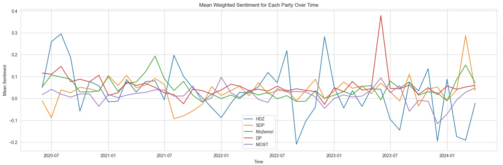
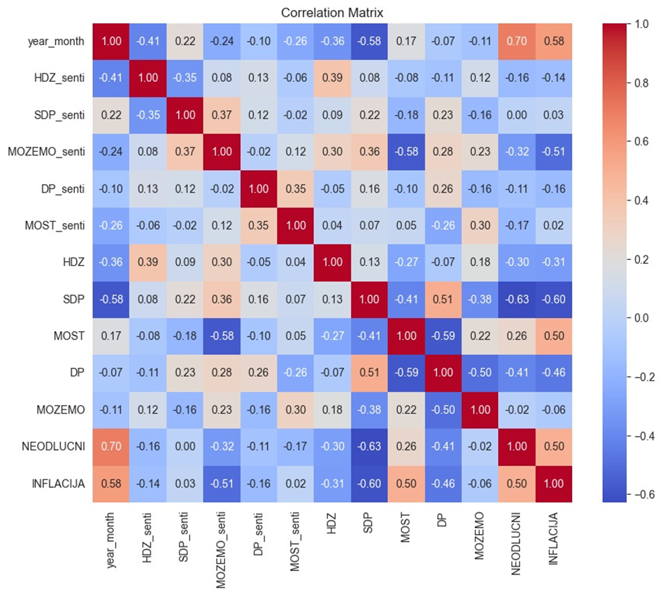
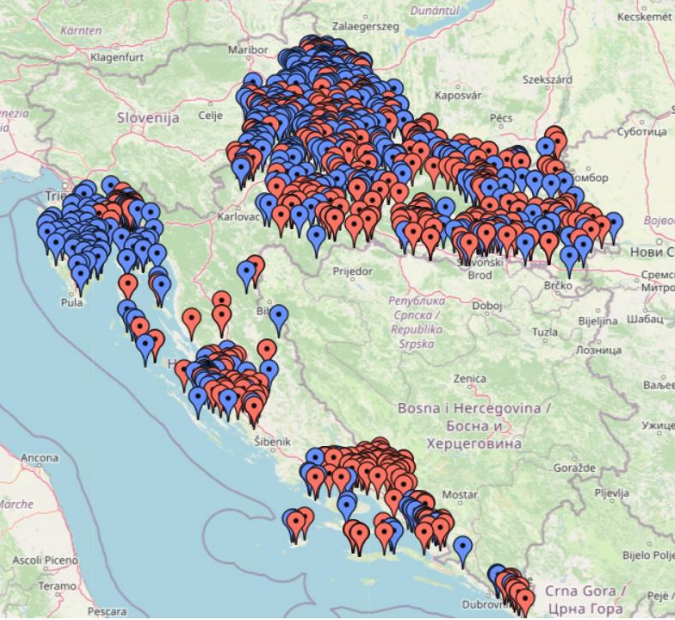
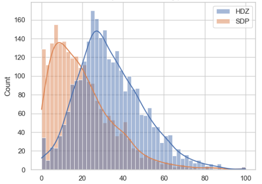

# Election Predictive Analysis Project

## Introduction
This project provides predictive analytics for electoral outcomes, integrating survey data, economic indicators, and sentiment analysis from various newspaper articles. We employ time series models, zero-shot classification, and monthly regression analysis to achieve our predictions.

## Data Sources
- **Survey Data**: Modeled as latent variables from aggregated sources.
- **Economic Variables**:
  - Real GDP per capita
  - Unemployment rate
  - Disposable income
- **Sentiment Analysis**:
  - Newspaper articles collected from June 2020 to April 2024.
  - Sentiment assessed using GPT-3.5 based on tailored prompts.
  - Correlation analysis between sentiment data and party support.

## Methodology
### Sentiment Analysis
- **Data Retrieval**: Articles fetched using TakeLab Retriever.
- **Sentiment Assessment**: GPT-3.5 used for determining sentiment.
- **Analysis**: Processed results to identify correlation with party support.

### Election Unit Estimations
- **Vote Predictions**: Gross number of votes predicted for each party, accounting for turnout and historical survey data.
- **Correction for Fixed Electoral Units**: Identified and subtracted votes from fixed electoral units to refine the prediction of variable votes.
- **Bias and Mobilization Corrections**: Adjustments made for survey biases and mobilization by major parties.
- **Mandate Distribution**: Utilized the d'Hondt method for estimating mandate distribution across electoral units.

## Results

### Sentiment
Sentiment Analysis

Correlation matrix of sentiment and support for a political party

### Fixed electoral units

Map of fixed electorial units 

HDZ, blue 
SDP, red

Distribution of the support percentage for the fixed units

### Final Predictions 
Total predicted mandates for major parties, incorporating adjustments for known fixed votes.

| Political Parties | Predicted | Real |
|-------------------|-----------|------|
| HDZ               | 59        |  61  |
| SDP               | 44        |  42  |
| MOST              | 10        |  11  |
| DP                | 13        |  14  |
| MOŽEMO            | 11        |  10  |
| Other             | 6         |  5   |

## Conclusion
This analytical approach demonstrates significant potential in predicting electoral outcomes, which is essential for strategic decision-making in political campaigns. The insights into fixed vs. variable voting patterns are particularly valuable for understanding regional electoral dynamics.

